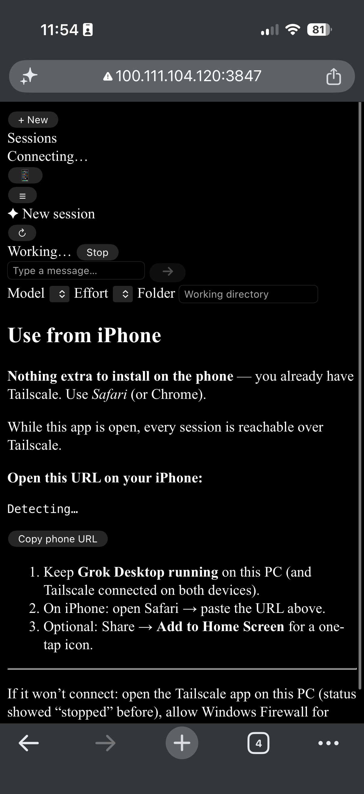

# Grok Desktop

A **Claude Desktop–style** UI for [Grok Build](https://grok.com): sessions on the left, chat in the center, model + effort on the bottom. Day-to-day use does not need a terminal.

Grok still runs on **your** machine (full tools, same sessions under `~/.grok/sessions`). The app shells out to the `grok` CLI in headless mode and streams the reply into a chat UI.

The same UI works in the Electron window and in mobile Safari over Tailscale while the app is running.



## Requirements

- **Node.js 18+**
- A **Grok** account ([x.ai](https://x.ai) / [grok.com](https://grok.com))

You do **not** need to install the Grok CLI or sign in from a terminal first. On launch the app checks both and walks you through it.

## First launch

```powershell
git clone https://github.com/dcasselwork123/grokdesktopapp.git
cd grokdesktopapp
npm install
```

Then either:

| How | Notes |
|-----|--------|
| Double-click **`Start Grok Desktop.vbs`** | Normal daily launch (no console) |
| Double-click **`Start Grok Desktop.bat`** | Same app; keeps a console if startup fails |
| `npm start` | Electron from a terminal |

The first window is a **setup gate**, not the chat:

1. **Install Grok CLI** — if `grok` is missing, the app shows the official install command ([x.ai/cli](https://x.ai/cli)) for Windows PowerShell or macOS/Linux, plus **Copy** and **Recheck**.
2. **Sign in** — pick **Sign in with X** or **Sign in with email**, matching the Grok account you actually use. That starts `grok login --oauth` and opens the Grok sign-in page in your browser. Finish there; the app polls until `~/.grok/auth.json` is valid, then the gate hides.

Each clone uses **your** Grok account. Nothing in this repo is a shared login.

Later you can switch or leave from the **account bubble** in the sidebar footer: Sign in with X, Sign in with email, or **Log out**.

### Server only (browser, no Electron)

```powershell
npm run server
```

Then open http://127.0.0.1:3847. The setup gate is the same.

## Features

| Area | What you get |
|------|----------------|
| **Setup gate** | Install CLI + Sign in with X or email before chat unlocks |
| **Account** | Sidebar avatar: who you’re signed in as, switch X/email, log out |
| **Sessions** | Real Grok sessions from `~/.grok/sessions`, grouped by project. Right-click to rename; Select to archive/delete |
| **Chat** | Dark chat UI; markdown tables; tool-call chips while Grok works |
| **Background turns** | Switching chats does not kill a run that is still going |
| **Queue** | Type a follow-up while a turn is running; it sends when Grok is free |
| **`/btw`** | Side chat in a new window (or tab) with a fork of the current session |
| **`/` menu** | Type `/` for New chat, Clear, Side chat, Imagine, Export, Help |
| **`/imagine`** | Ask Grok to generate an image from a description |
| **`/export`** | Download the open chat as Markdown |
| **`/clear`** | Wipe this chat’s context; stay in the same session |
| **`/new`** | Fresh draft in the same folder |
| **Images** | **+**, paste, or drag-and-drop (max 8). Re-encoded to JPEG on the client. Pictures Grok generates (`/imagine`) show in the chat |
| **Voice** | Mic next to Send; [Grok Speech-to-Text](https://docs.x.ai/developers/model-capabilities/audio/speech-to-text) fills the box **as you speak**. On the phone, use the **HTTPS** Tailscale URL (`https://….ts.net` — free Let’s Encrypt). Plain `http://100.x` cannot open the live mic; the button then asks for a Voice Memo / file |
| **Model / Effort** | Composer selectors, including a custom model picker |
| **Usage** | Weekly usage pie in the composer; click for session context |
| **Folder** | Desktop: native folder dialog. Phone: known project folders or the last desktop folder (not a free-form `C:\` path) |
| **Access control** | Default **Full access** (tools run). **Safer** denies tools in this UI (turns usually cancel). Phone uses the same PC setting — it can code. The phone cannot change the mode. |
| **First-seen folder** | Desktop warns once when you open a working folder Grok has not used here before |
| **Stop** | Cancel an in-flight run |
| **Phone** | Same UI in Safari; reconnects if iOS drops the stream |
| **Updates** | **Update available** in the sidebar when GitHub has a new commit. Confirm, then the app pulls and restarts (checks at most every 30 minutes) |

## Use from iPhone

Keep Grok Desktop running on the PC. On the PC, click **📱** in the sidebar footer and **Copy phone URL**.

1. Install [Tailscale](https://tailscale.com/download) on the PC and iPhone; sign into the same account.
2. On the phone, open the copied URL in Safari. The `?token=` query is a **one-time bootstrap**; the server then sets an **HttpOnly SameSite=Strict cookie**. The address bar is cleaned; the token is **not** stored in localStorage. Later API fetches do **not** put the token in the query string.

Default bind is **loopback + Tailscale** (`127.0.0.1` and the PC’s `100.x` address), not all interfaces. When Tailscale **HTTPS Certificates** are on (free, [admin DNS page](https://login.tailscale.com/admin/dns)), the copied phone URL is `https://<pc-name>.<tailnet>.ts.net:<port>/?token=…` so iPhone Chrome/Safari can use the live mic. A random token is stored in `~/.grok-desktop/config.json`. You do not need to set env vars for the usual case.

If you still have an old `http://100.…` bookmark, copy the phone URL again after relaunching the desktop app.

Loopback (`127.0.0.1`) does not need a token. Anything remote does — after that first `?token=` load, the cookie keeps CSS/JS and API calls working.

`GET /api/health` does **not** return the raw token. `GET /api/remote` returns the copyable phone URL **only on loopback** (the PC window).

**Rotate phone access** in the 📱 modal mints a new token. Existing phone tabs will need the new URL.

On the phone, chat cwd is a **known project folder** from existing sessions or the **last folder chosen on the desktop** — not a free-form `C:\` path.

The phone **cannot** apply in-app updates or start Grok sign-in (OAuth). Do those on the PC, then reload Safari (or tap Recheck on the setup gate).

**LAN (opt-in):** 📱 **Allow LAN (trusted network)**, or set `GROK_DESKTOP_ALLOW_LAN=1` / `GROK_DESKTOP_HOST=0.0.0.0`. Only do this on a network you trust — cafe/public Wi‑Fi can then reach the app.

Windows Firewall: allow **Private / Tailscale**, not Public.

## Access control and containment

Grok still runs **on this PC** with real tools. The desktop app can shrink what a bad prompt or a stolen phone token is allowed to do. It cannot make an agent that reads a hostile repo “safe.”

**Desktop — Access control** (composer, next to model / effort):

| Mode | CLI flag | What it means |
|------|----------|----------------|
| **Full access** (default) | `--permission-mode bypassPermissions` | Tools run without asking. This is the usual coding-agent mode. |
| **Safer** | `--permission-mode dontAsk` | Tools are **denied** and the turn usually **cancels**. Talk-only; not useful for coding. |

The setting is stored in `~/.grok-desktop/config.json` as `permissionMode`. Change it on the PC (Access control). The phone uses that same value so you can send coding work from Safari.

**Remote / phone:** uses the PC Access setting (Full access by default). The phone JSON body cannot override it. Chat cwd is still a known project folder or last desktop folder — not a free-form `C:\`.

**First-seen folder:** the first time a desktop working folder is not in `seenFolders`, the composer shows a one-line warning that Grok can read and run against whatever is in that folder (a newly cloned repo counts). The path is recorded after the first successful send or an explicit dismiss. The phone already picks a known project, so it does not nag again.

**Window chrome:** the Electron window only navigates to the local API origin (`http://127.0.0.1:<port>` / `localhost`). Markdown / context-menu links open in the system browser **only** if they are `http:` or `https:` — `file:`, `javascript:`, `data:`, and custom protocols are denied. The page has a Content-Security-Policy of `default-src 'self'` (images may be `data:` / `blob:`; styles may be inline; no inline scripts).

**Honest limit:** a repo you asked Grok to work in can still inject via README, issues, or images. These controls shrink blast radius. They do **not** delete the agent problem.

## Environment variables (optional)

Defaults live in `~/.grok-desktop/config.json`. Env vars override the file.

| Variable | Default | Meaning |
|----------|---------|---------|
| `GROK_DESKTOP_PORT` | `3847` | HTTP port |
| `GROK_DESKTOP_HOST` | loopback + Tailscale | Bind address. Set `0.0.0.0` only to force all-interfaces (same as Allow LAN) |
| `GROK_DESKTOP_ALLOW_LAN` | off | `1` / `true` listens on the LAN as well (cafe/public Wi‑Fi can then reach the app) |
| `GROK_DESKTOP_TOKEN` | auto-generated | Phone-access token. Safari bootstrap uses a one-time `?token=` URL, then an HttpOnly SameSite=Strict cookie. API fetches do not put it in the query string. |
| `GROK_BIN` | auto | Path to `grok` / `grok.exe` |
| `GROK_HOME` | `~/.grok` | Grok config/sessions root |

## How it works

```
┌─────────────────┐     HTTP / SSE      ┌──────────────────┐     spawn      ┌─────────────┐
│  Electron /     │ ──────────────────► │  Node API        │ ────────────► │ grok -p …   │
│  Safari (phone) │ ◄────────────────── │  server/httpApi  │ ◄──────────── │ streaming-  │
└─────────────────┘   chat events       └──────────────────┘   NDJSON      │ json        │
                                                      │                     └─────────────┘
                                                      ▼
                                            ~/.grok/sessions/*
```

- **Setup:** `GET /api/setup` — CLI present? `auth.json` valid?
- **Sign-in:** `POST /api/auth/login` → `grok login --oauth` (X or email in the browser)
- **Send:** `grok -p "…" --output-format streaming-json` (plus `--resume` when continuing)
- **Images:** saved under `~/.grok-desktop/uploads/`; absolute paths go in the `-p` prompt so Grok can `read_file` them

Sessions created here are the same ones the Grok CLI uses.

## Data on your machine (not in this repo)

| Path | Purpose |
|------|---------|
| `~/.grok/sessions/` | Real Grok session store (shared with the CLI) |
| `~/.grok/auth.json` | Your Grok credentials — **never commit** |
| `~/.grok-desktop/config.json` | Bind host/port, phone token, `allowLan`, `permissionMode`, `seenFolders`, last desktop cwd |
| `~/.grok-desktop/uploads/` | Attached images |
| `~/.grok-desktop/debug.log` | Optional spawn/stream debug lines |

## Working on the app

[`AGENTS.md`](AGENTS.md) is the project brief: layout, features to keep working, setup-gate rules, and how to start it. Read that before changing code.

There is no compile step. Launchers load the files on disk — quit and relaunch after edits.

## Troubleshooting

**Setup gate won’t go away**
- Install: `irm https://x.ai/cli/install.ps1 | iex` (Windows) or `curl -fsSL https://x.ai/cli/install.sh | bash`, then **Recheck**.
- Sign-in: use **Sign in with X** or **Sign in with email**, then finish in the browser that opened on the PC. You can also run `grok login --oauth` in a terminal and Recheck.
- Auth file: `%USERPROFILE%\.grok\auth.json` (Windows) or `~/.grok/auth.json`.

**Send fails / empty reply**  
Confirm you’re signed in (account bubble in the sidebar). In a terminal: `grok -p "hi" --output-format json`.

**Phone can’t connect**
- App must be running on the PC
- Use the **📱 Copy phone URL** link (one-time `?token=` bootstrap, then cookie)
- If you rotated phone access, copy the **new** URL; old phone tabs will fail until they load it
- Use the Tailscale IP, not `127.0.0.1`, on the phone (or a LAN IP only if you enabled **Allow LAN**)
- Windows Firewall may prompt on first bind — allow **Private / Tailscale**, not Public

**Sessions missing**  
They live under `%USERPROFILE%\.grok\sessions`. The app lists folders that have a `summary.json`.

**Port already in use**  
Set `GROK_DESKTOP_PORT`, or quit the other process on 3847.

## License

Source is public so you can run and modify it. No warranty. You need your own Grok account; this repo does not ship credentials.
